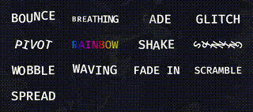
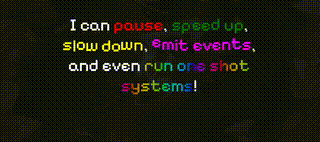

[](https://crates.io/crates/bevy_pretty_text)
[](https://docs.rs/bevy_pretty_text)

**Pretty Text** is a text effects library for [Bevy](https://bevyengine.org/).

## Demos

`cargo run --bin showcase`<br>



---

`cargo run --bin typewriter`<br>

```rust
pretty!(
    "I can `pause`[red],\
        [1] <2>\
        `speed up`[shake, green],\
        [0.5] <0.5>\
        `slow down`[wobble, yellow],\
        [0.5]<1> \
        {my_event}`emit events`[bounce, fuchsia],\
        [0.5] and even \
        {}`run one shot systems`[rainbow]![3]",
    |mut commands: Commands, server: Res<AssetServer>| {
        commands.spawn(AudioPlayer::new(server.load("bing.wav")));
    },
)
```



---

`cargo run --bin demo`<br>


## Getting Started

First, add `bevy_pretty_text` to the dependencies in your `Cargo.toml`:
 
```toml
[dependencies]
bevy_pretty_text = "0.1"
```

Then, you'll need to add the `PrettyTextPlugin` to your app.

```rs
use bevy::prelude::*;
use bevy_pretty_text::prelude::*;

fn main() {
    App::default()
        .add_plugins((DefaultPlugins, PrettyTextPlugin))
        .run();
}
```

And then you can make some _pretty text_!

```rust
fn spawn_text(mut commands: Commands) {
    // Spawn wavy `Text`.
    commands.spawn((
        Text::new("Hello, World!"),
        Wave::default(),
    ));

    // Use the typewriter.
    commands.spawn((
        Typewriter::new(30.),
        Text2d::new("My text is revealed one glyph at a time"),
        Transform::from_xyz(0., 200., 0.),
    ));

    // Spawn a style entity.
    commands.spawn((
        PrettyStyle("my_style"),
        TextColor(Color::WHITE),
        effects![
            Shake::default(),
            Wave::default(),
        ],
    ));

    // Parse rich text and use custom style.
    commands.spawn((
        pretty!("I am [1]<0.8>*sniff*[1]<1.2> very `pretty`[my_style]![3]<1>"),
        Transform::from_xyz(0.0, -200.0, 0.0),
    ));
}
```

[The repository examples](https://github.com/void-scape/pretty-text/examples/src/bin) should help you get up to speed on common usage patterns.

## Feature flags

| Flag              | Description                                 | Default feature |
| ----------------- | ------------------------------------------- | --------------- |
| `serialize`       | Enable serialization for `ParsedPrettyText`.| No              |

## Bevy version compatibility

| `bevy` | `bevy_pretty_text` |
| ------ | ------------------ |
| 0.16   | 0.1-0.2            |

## License

Pretty Text is free and open source. All code in this repository is dual-licensed under either:

- MIT License ([LICENSE-MIT](/LICENSE-MIT) or <http://opensource.org/licenses/MIT>)
- Apache License, Version 2.0 ([LICENSE-APACHE](/LICENSE-APACHE) or <http://www.apache.org/licenses/LICENSE-2.0>)

at your option.
